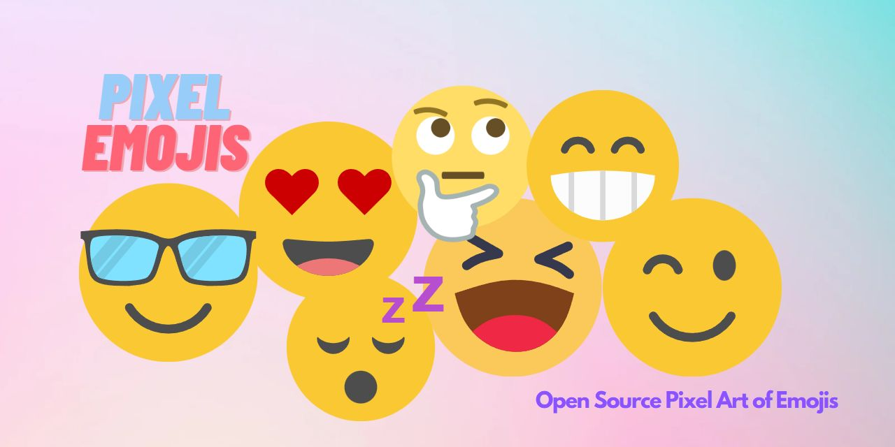

# Emoji Pixel Art 👩‍🎨


*This project contains pixel art of emojis. All pixel arts are made in 32x32 canvas.* 

[](./LICENSE)


[](https://github.com/iamBijoyKar/emojis-pixel-art/issues)
[](https://twitter.com/iamBijoyKar)

## Info 📄 
***All of the pixel arts are made with [Pixilart](https://www.pixilart.com/) and preset on my [Pixilart Profile](https://www.pixilart.com/iambijoykar)*** 

**My Profile 👉 https://www.pixilart.com/iambijoykar**

# Emojis 
| Emoji | Pixel Emoji  | Pixil File  |
| ------- | --- | --- |
| 😀 | | [grinning-face](./pixilart/pixil-files/grinning-face.pixil) |
| 😄 |  | [smiling-face-with-smiling-eyes](./pixilart/pixil-files/smiling-face-with-smiling-eyes.pixil) |
| 😄 | | [smiling-face-with-open-mouth-and-smiling-eyes](./pixilart/pixil-files/smiling-face-with-open-mouth-and-smiling-eyes.pixil) |
| 😅 | | [smiling-face-with-open-mouth-and-cold-sweat](./pixilart/pixil-files/smiling-face-with-open-mouth-and-cold-sweat.pixil) |
## License ✅
***We have a [MIT License](LICENSE)***
Use this project as you like.

## Code of Conduct 🧚
Please follow our [Code of Conduct](CODE_OF_CONDUCT.md) and make a good and healthy open source community.
## Contribution ❤️
We welcome contributors warmly, we are encouraging everyone to contribute as much as possible. Even a little bit change of text is acceptable. Help us to grow this project.

- Fork the repository 
- Clone the repository in your local system
  ```bash
  git clone <repository url>
  ```
- Enter into the project directory by 
  ```bash
  cd <project directory name>
  ```
- Make changes and make a PR 

### Follow the [Contribution Guidelines](CONTRIBUTING.md) and [Wiki](https://github.com/iamBijoyKar/emojis-pixel-art/wiki) for more details

## 😍 Give a star 🌟 if you like the project 🥰
